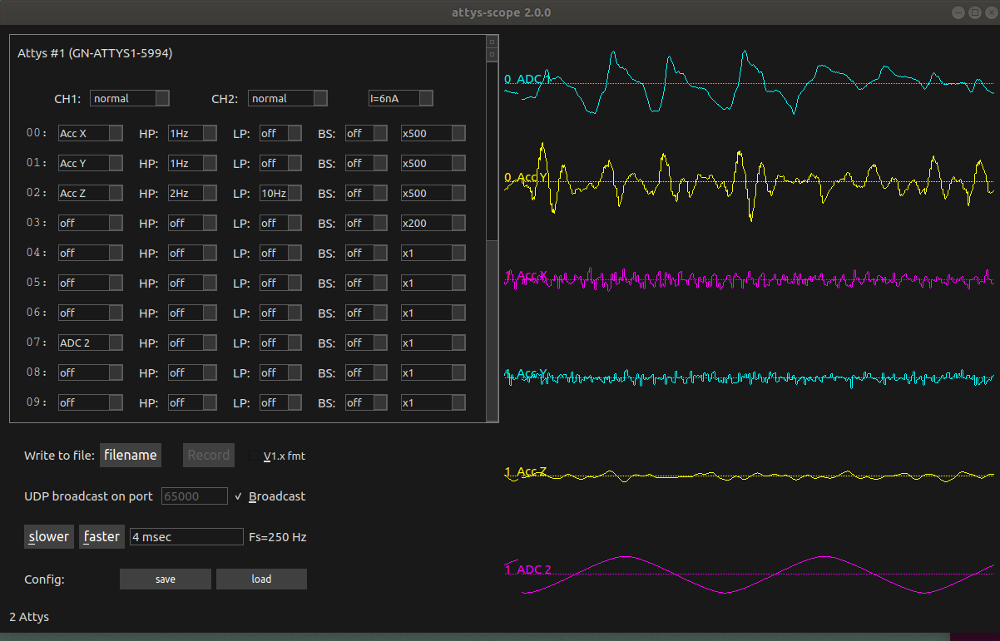

# AttysScope (Windows/Linux)

Plotting program for the Attys for Windows/Linux

https://github.com/glasgowneuro/attys_scope

## Features

* Records from multiple Attys at the same time. For example, you can attach two Attys to both the upper and lower arm to measure muscle activity, acceleration and orientation.
* Tested BT dongles which work with more than one Attys: ASUS-BT400 and Belkin.
* Write realtime add ons in Python to visualise data or feed the data into your favourite game engine (UDP broadcast).
* Saves data as tab separated values which can be directly imported into Python, MATLAB ™, OCTAVE, R, GNUPLOT and many other software packages.
* Change the gain, highpass, lowpass, 50/60Hz bandstop and rectifier for amplitude plots
* Compiles under Windows and Linux (QT5)

## Requires
* QT5
* IIR1 libaray

## Compile under Windows
* Install: Visual Studio 2017 community edition
* For windows download the open source version of QT5, 64 bits for visual C++ 2015/2017 from 
  https://download.qt.io/official_releases/qt/5.7/5.7.0/qt-opensource-windows-x86-msvc2015_64-5.7.0.exe
* cd attys_scope, Clone iir1 as a subproject: https://github.com/berndporr/iir1
* optional: qmake -tp vc
* Open the .sln file
* Build solution

## Compile under Linux
* Make sure the QT5 development packages and bluetooth packages are installed
* Install the IIR filter library https://github.com/berndporr/iir1
* cd attys_scope
* qmake
* make
