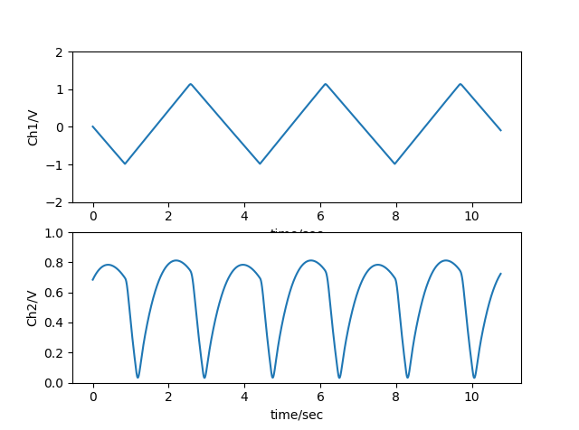
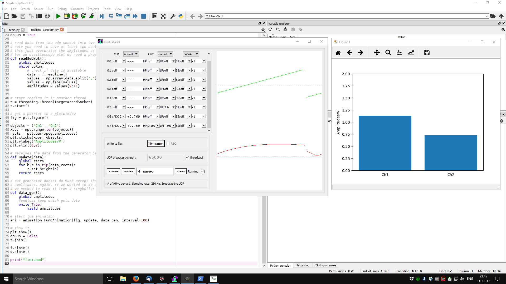
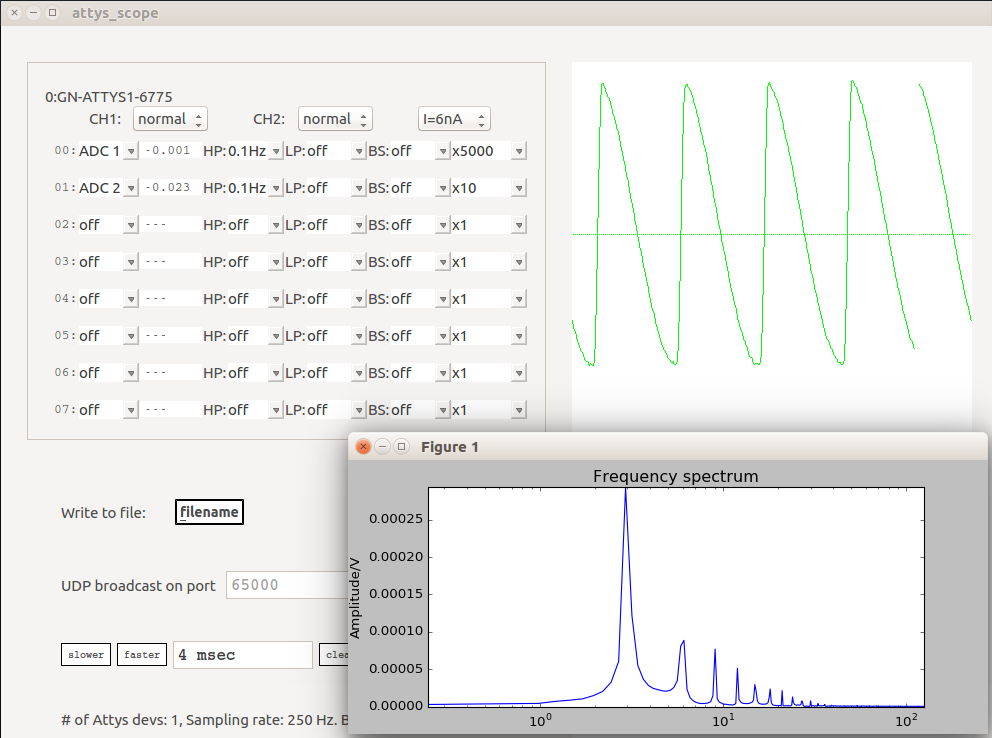
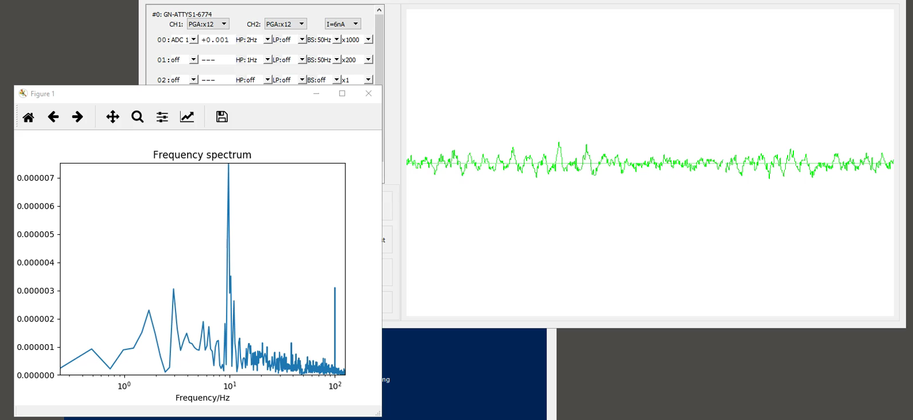

# attys_scope
Python scripts to demonstrate how to process data with
attys_scope for Linux/Window afterwards and in realtime.

All realtime demos read the data via the UDP port 65000.
Make sure attys_scope's broadcast is on.

## plot_demo_data.py
Plots data from a file recorded by attys_scope.

## realtime_plot.py
Realtime plot of data: The scripts reads the data from
attys_scope via its UDP port.

## realtime_bargraph.py
Shows in realtime the amplitude of the 1st two selected
signals in attys_scope

## realtime_spectrum.py
Shows in realtime the Fourier Spectrum of the 1st channel selected
in a semilog scale.

## realtime_heartrate.py
Realtime heartrate detection. The actual detector is in the
module ecg_analysis.py

