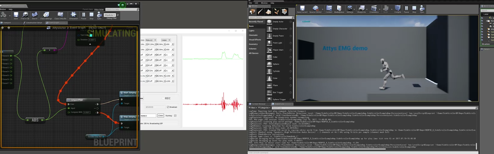
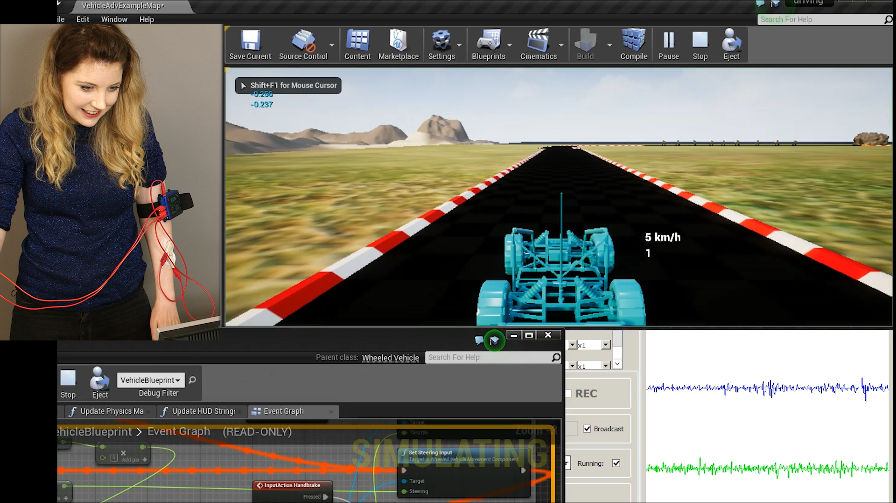
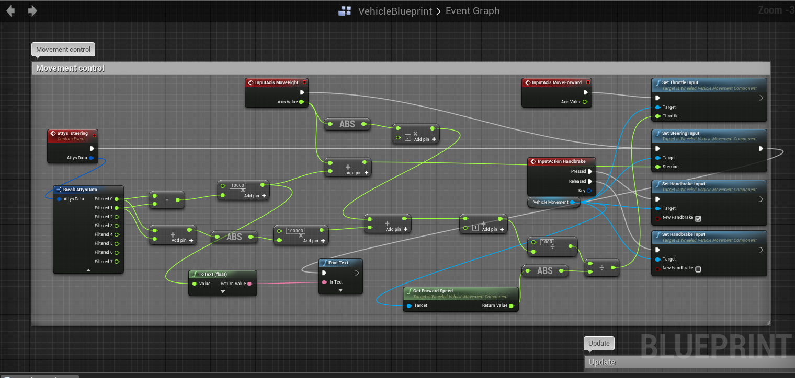

# attys_scope
## UDP receiver for UNREAL

[Video of the jump/run game](https://www.youtube.com/watch?v=50HHXOzv6MY)

This is the blueprint of the driving scenario

[Video of the driving game](https://www.youtube.com/watch?v=Bg3GVRUUBRI&feature=youtu.be)

=======

With the help of this C++ class you can
create an Attys outlet which provides you
with all filtered / visible channels
in AttysScope.

## Installation

 * Create an "AttysActor" C++ class within the UNREAL editor
 * Replace the template AttysActor.cpp and AttysActor.h with the files provided here
 * Replace the "SCROLLER" in "SCROLLER_API" with the name of your project in AttysActor.h
 * Add "Sockets", "Networking" to the "*.Build.cs" file
 * Compile the solution and start debugging
 * Create a blueprint from it
 * Right click in the Blueprint and search for Attys: Add Event: BPEvent Attys Data Received
 * Click on Received Data and pull out Break AttysData
 * Filtered0, Filtered1, etc correspond to the traces in AttysScope: Trace0, Trace1, etc

## Usage

 * Just make sure UDP broadcast is enabled in AttysScope and the port
   is 65000 (default).
 * Select the sensors you'd like to see
 * They will show up in the order you've selected them in UNREAL

See https://wiki.unrealengine.com/UDP_Socket_Sender_Receiver_From_One_UE4_Instance_To_Another
for more info!
